## Open Shore Labs

I build software products end to end: desktop, mobile, web, and the backend
behind them. Two of them are live today.

---

### OpenShore · [openshore.ai](https://openshore.ai)

A coding agent that runs on your own models, your own machine, and your own
keys. Chat and build on Linux, macOS, and Windows today, with iPhone and iPad
next. Cloud models stay one deliberate tap away, always on your own account.

- **Local first.** Runs on open models on ordinary hardware, including CPU-only machines.
- **Private by construction.** Keys never leave your devices, and everything is encrypted at rest.
- **Desktop and phone in sync** over your own private network.

<table>
  <tr>
    <td width="33%">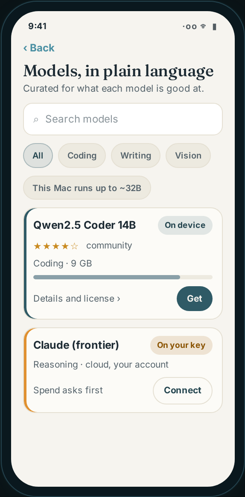</td>
    <td width="33%">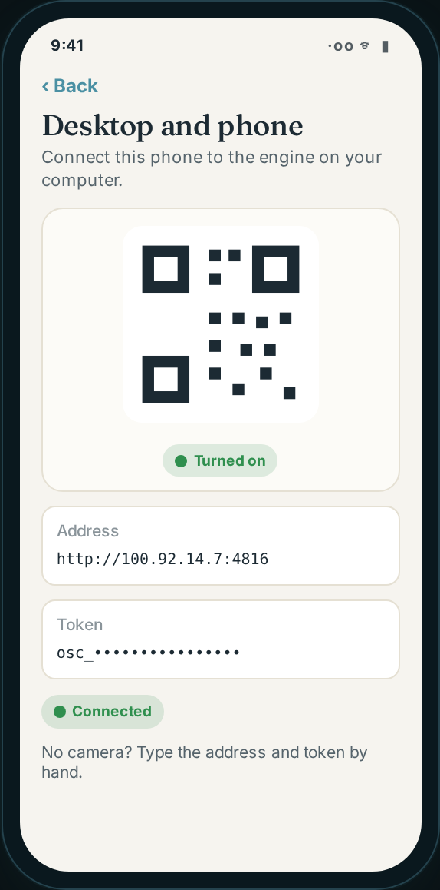</td>
    <td width="33%" valign="top">
      <b>Models, in plain language.</b> Pick a model for each kind of work, see what your machine can run, and connect a cloud model on your own key.  
      <b>Pair the phone.</b> Scan one QR code and your phone becomes a remote control for the engine on your computer.
    </td>
  </tr>
</table>

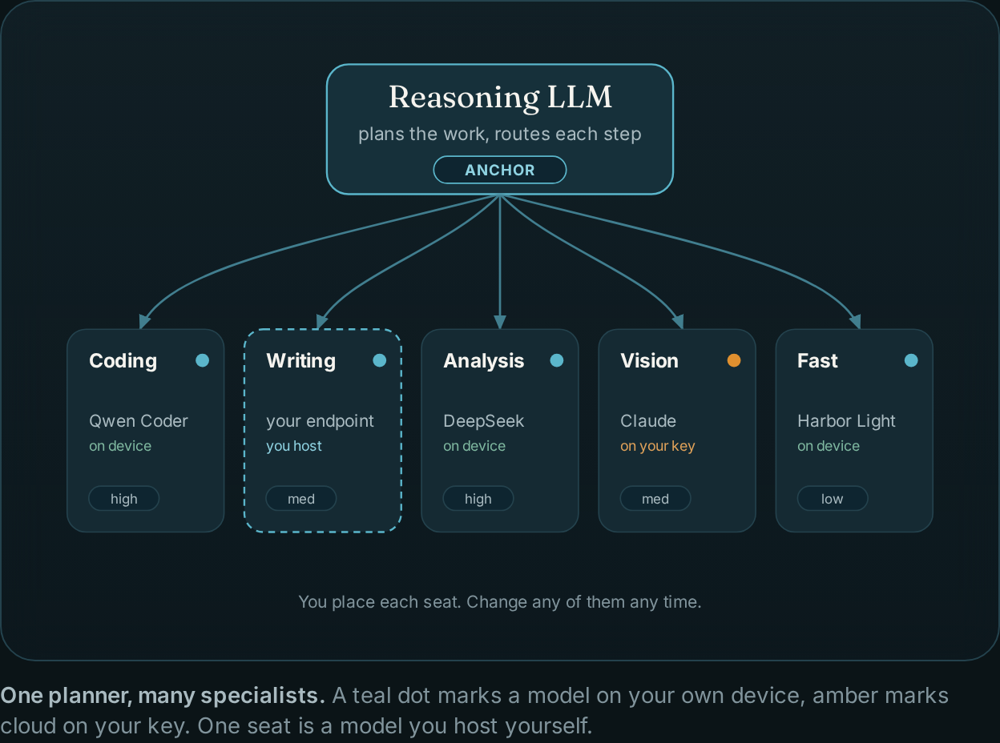

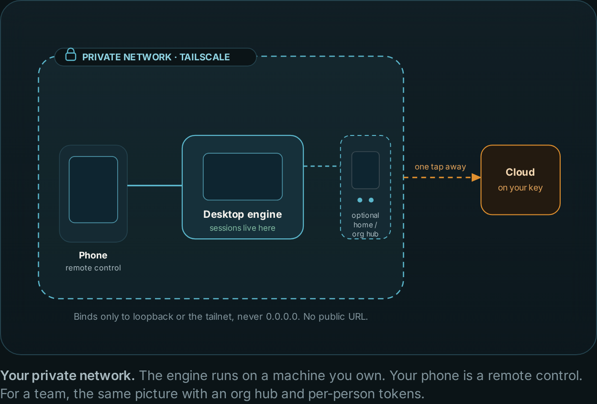

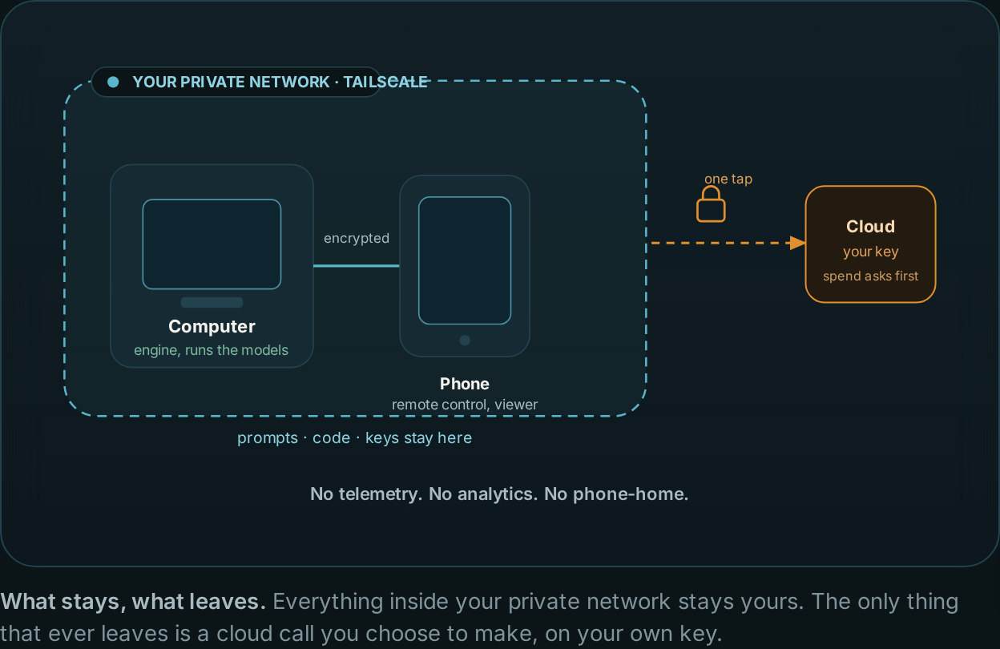

---

### Uki · [uki.audio](https://uki.audio/open/)

[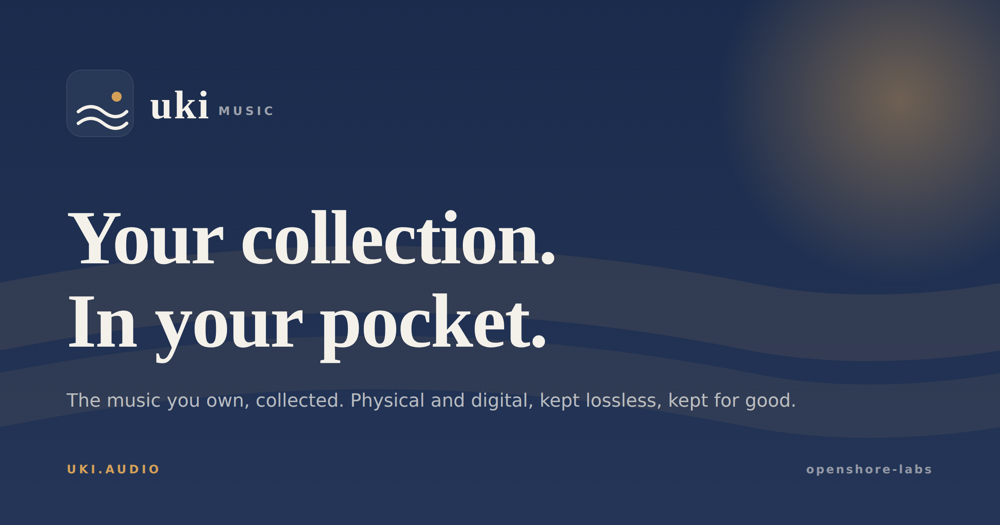](https://uki.audio/open/)

The music you own, collected. Physical and digital, kept lossless, kept for
good. Collect vinyl, CDs, and tape from your own gear, bring in your files and
your iTunes library, tune in to live radio, and ask Spin, the built-in music
assistant, for the story behind a record.
[Get it on the App Store](https://apps.apple.com/app/id6786288929).

<table>
  <tr>
    <td width="20%">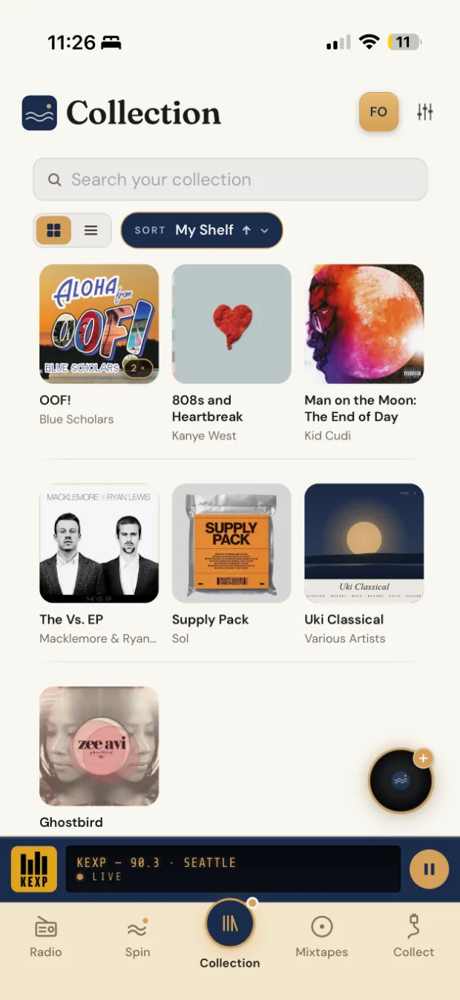</td>
    <td width="20%">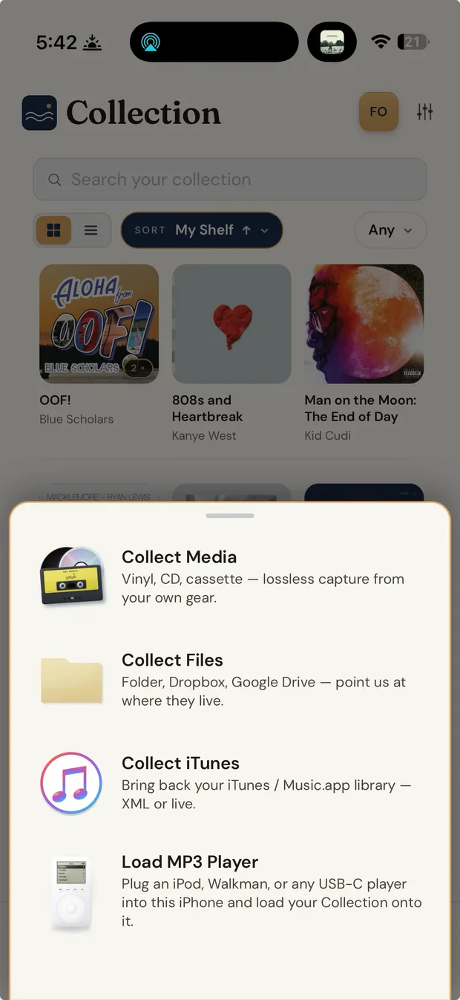</td>
    <td width="20%">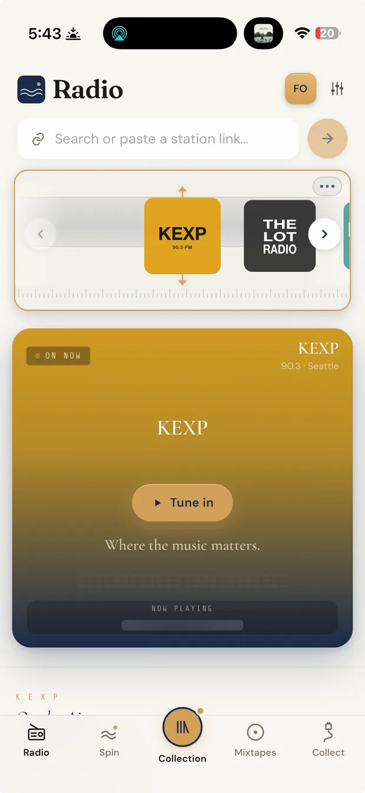</td>
    <td width="20%">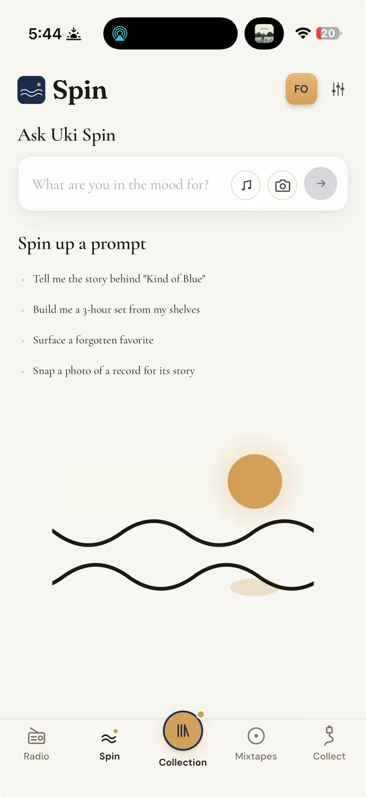</td>
    <td width="20%">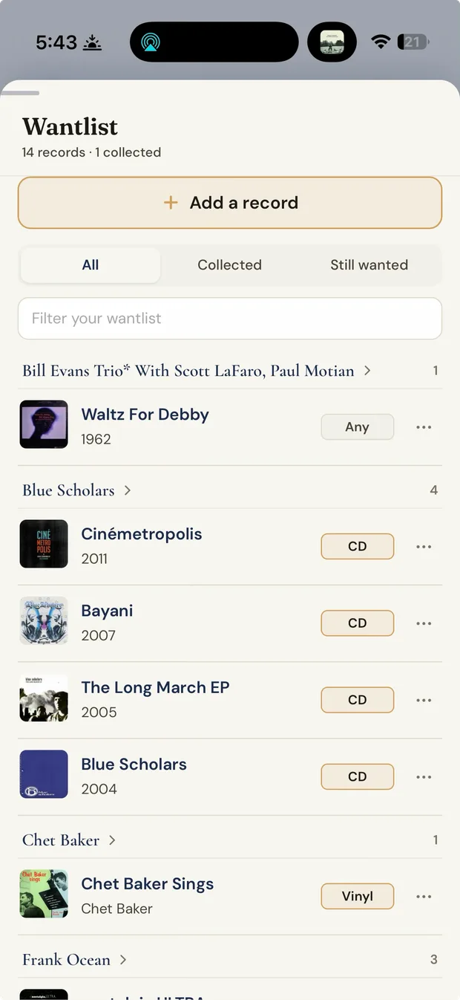</td>
  </tr>
  <tr>
    <td align="center">Collection</td>
    <td align="center">Collect</td>
    <td align="center">Live radio</td>
    <td align="center">Spin</td>
    <td align="center">Wantlist</td>
  </tr>
</table>

- iPhone, iPad, CarPlay, Android, desktop, and the web from one codebase
- Every collection, mixtape, and setting synced to your account

---

### What I work with

TypeScript · React · Node · Electron · Capacitor (iOS and Android) · Swift ·
Supabase and Postgres · Cloudflare Workers · Stripe · local and cloud LLMs

### Get in touch

The product code is closed source. I'm happy to walk through the architecture
and the engineering behind either product in a conversation.
